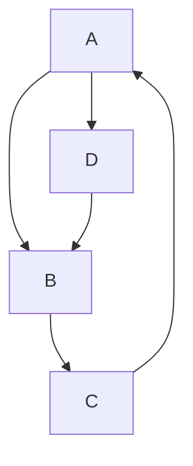

## About Mitch Allen

I have worked for software companies in Silicon Valley, along Boston's Route 128 and in New York's Silicon Alley. I currently work for a robotics and logistics company in Massachusetts.

## Projects

### Hardware and Software Blogs

* https://scriptable.com/ - my blog on JavaScript, TypeScript, Go (Golang) and React
* https://desertbot.io/ - my Raspberry Pi and Arduino blog that averages 35-40K pageviews per month

### Generative Art

* https://mitchallen.art/ - the hub for my experiments with generative art 
* https://scriptaverse.com/ - my experiment with hosting my own metaverse using ThreeJS and IPFS 
* https://objkt.com/profile/mitchallenart/created - my online art gallery on objkt
* https://rarible.com/mitchallenart/ - my Clean (Tezos) NFT profile on Rarible
* 😦 DOA?: hicetnunc.art/mitchallen - my Clean (Tezos) NFT profile on Hic Et Nunc (.art version) 

### Go (Golang) Packages

* https://pkg.go.dev/search?q=mitchallen/

### NPMJS Packages

* https://www.npmjs.com/~mitchallen - my NPMJS packages

### Docker Images

* https://hub.docker.com/u/mitchallen

### Books

* http://amazon.com/author/mitch.allen

### Home Page

* https://mitchallen.com/

## Mermaid Test

<!--
**mitchallen/mitchallen** is a ✨ _special_ ✨ repository because its `README.md` (this file) appears on your GitHub profile.

Here are some ideas to get you started:

- 🔭 I’m currently working on ...
- 🌱 I’m currently learning ...
- 👯 I’m looking to collaborate on ...
- 🤔 I’m looking for help with ...
- 💬 Ask me about ...
- 📫 How to reach me: ...
- 😄 Pronouns: ...
- ⚡ Fun fact: ...
-->
